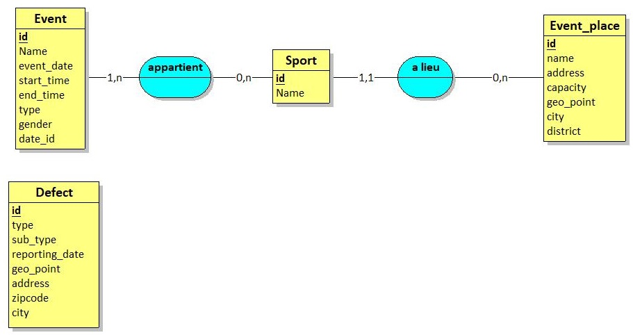

# Projet fil rouge groupe 14 - Efficient Back part
 
 
 ## **Installation du projet**
 
 * Cloner le repo (normalement cela à déjà du etre fait pendant l'installation du docker pour ceux concerné).
 
 * Exécuter `composer install` puis `yarn`.
 
 ## **Personne concerné**
 * Maxime ZINUTTI
 
 ## **Dossier d'argumentation**
 
 ### Technologies et librairies
 Pour ce projet j’ai utilisé Symfony 4.3.11 avec Nelmio pour construire la document de l’API, Symfony Encore pour compiler le JS et le CSS de Nelmio et quelques autres petites dépendances plutôt classique de Symfony 4.
 Pour faire marcher le projet en local j’ai construit un Docker, disponible sur ce repository : https://github.com/MydroX/Docker-Efficient-API
 
 ### Base de données
 Pour la base de données, au début du projet j’ai téléchargé la base “Dans ma rue” sur Open data Paris en CSV, donc j’ai pris les colonnes qui m'intéressait et tout transposé avec un script en SQL. Pour le reste des données tout été créé à la main grâce à de multiple source d’information.
 
 Voici le MCD de cette base : 
 
 ### Relation One to Many
 Une relation One to Many correspond dans notre cas à cette relation correspond à une relation entre un sport et un lieu car, un sport ne peut pas avoir plusieurs lieu d’où le “one” mais à contrario un lieu peut accueillir plusieurs sport donc “many”.
 
 ### Construction de l’API
 Pour la construction de l’API, j’ai commencé à construire mon Docker et à setup le Symfony,en installant les dépendances que j’avais besoin, au début du projet et à ce moment là je connaissais de nom “API Platform”, donc c’est pour cela que je n’ai pas choisi cette option et que je suis partis sur Symfony seul, ce qui me laissait plus d’options et de facilité en cas de changement sur le projet.
 
 Pour commencer,  j’ai schématisé ma base de donnée et fais les entités en fonction, ensuite créer les endpoints de base dans les controllers, avec un controllers par entités. Puis j’ai attendu que le front avance et me dise qu’elle était leur besoins en termes de données. Avec leurs réponse j’ai construit les endpoints grâce à leurs différentes demandes.
 
 Etant donnée que notre projet est réparti sur 2 repo (front et back), pour simplifier le travail en local des front en essayant de faire fonctionner la partie API en local et l’app front en local aussi, j’ai préféré directement mettre l’API en ligne grâce à un VPS (Ubuntu 18.04 LTS sur OVH) que j’ai setup.
 
 ### Doc API
 La doc de l’API a été faite avec la dépendance Nelmio qui intègre Swagger via la PHP Doc, donc j’ai simplement suivi la page de documentation officielle Symfony pour Nelmio pour créer ma doc. Elle accessible via la route (/api/doc).
